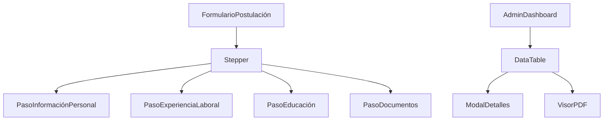

# 📄 Postulaciones App - Frontend

Aplicación moderna para gestión de postulaciones laborales con interfaz intuitiva para candidatos y administradores.

## 🚀 Tecnologías Principales

- **Next.js 15** (App Router)
- **TypeScript**
- **Material-UI (MUI) v6**
- **Formik + Yup**
- **SWR** para gestión de datos
- **React PDF** para visualización de CVs

## 🌟 Características Destacadas

### Para Postulantes
✔ Formulario multi-paso con 4 secciones  
✔ Validación en tiempo real  
✔ Subida de CV en PDF  
✔ Diseño responsivo  

### Para Administradores
📋 Listado paginado de solicitudes  
🔍 Modal de detalles completo  
📄 Visor PDF integrado (zoom/navegación)  
✅ Marcar postulaciones como "vistas"  

## 🛠️ Configuración Local

### Prerrequisitos
- Node.js (≥ 18.x)
- Backend Laravel ejecutándose (consulta su [README](https://github.com/enriquemdev/postulaciones-api)  )

### Instalación
```bash
# 1. Clonar repositorio
git clone https://github.com/enriquemdev/postulaciones-app.git
cd postulaciones-app

# 2. Instalar dependencias
npm install

# 3. Configurar entorno
cp .env.example .env.local
# Editar .env.local con tu URL de backend

# 4. Iniciar servidor
npm run dev
```

Visita http://localhost:3000 para acceder a la aplicación.


## ✅ Buenas Prácticas Implementadas
| Área               | Implementación                                                                 |
|--------------------|-------------------------------------------------------------------------------|
| **TypeScript**     | Tipado estricto en componentes, servicios y formularios                      |
| **Rendimiento**    | Memoización, carga diferida, paginación del servidor                        |
| **Código Limpio**  | Conventional Commits, estructura modular                    |
| **UI/UX**          | Diseño responsivo, accesibilidad, feedback visual (toasts/modales)          |
| **Gestión Estado** | SWR para caching, actualizaciones optimistas, estado local minimizado       |

## 📄 Componentes Clave



## 📬 Contacto

¿Preguntas o sugerencias?  
✉️ [enriquemunozdev@gmail.com](mailto:enriquemunozdev@gmail.com)  